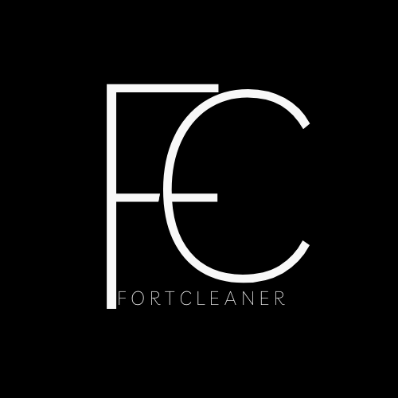

# 🚀 FortCleaner

> 🧹 The Ultimate Fortnite Trace Cleaner

## 🌟 Overview

`FortCleaner` is a dedicated tool designed to remove all traces of Fortnite from your system, ensuring a clean slate for fresh installations or other purposes.

## 🎉 Features

- 🟢 Multiple cleaning modes: Light, Basic, Moderate, Advanced, Deep, and Advanced Deep.
- 🔵 User-friendly interface with easy navigation.
- 🔴 No additional dependencies required.

## 📖 Usage Guide

1. **Download**: 📥 Clone this repository or download the latest release.
2. **Extract**: 📂 If downloaded as a compressed file, extract the `.rar` or `.zip` file using a tool like WinRAR or 7-Zip.
3. **Setup**: 🗂 Navigate to a location on your PC, create a new folder named "FortCleaner", and move the extracted contents and the `FortCleaner.exe` into this folder.
4. **Execute**: 🖱 Double-click on `FortCleaner.exe` to run the tool. Choose the desired cleaning option and follow any on-screen prompts.

## ⚠️ Safety & Precautions

- 🛡 Only run tools and executables from trusted sources. If uncertain, always scan with a reputable antivirus program before executing.
- 💾 Ensure you have backups of essential data before running any cleaner tool. 
- 🚫 This tool is provided as-is, without any guarantees or liabilities.

## 💌 Feedback and Contributions

For feedback, issues, or feature requests, please open an [issue on GitHub](https://github.com/The-Only-Star/ForeCleaner/issues). Contributions via pull requests are welcome!

## License 📜

This project is licensed under the MIT License - see the [LICENSE.md](LICENSE.md) file for details.

## 📊 Language Breakdown

| Language   | Percentage |
|------------|------------|
| Python     | 90%        |
| Batch      | 9%         |
| Markdown   | 1%         |
